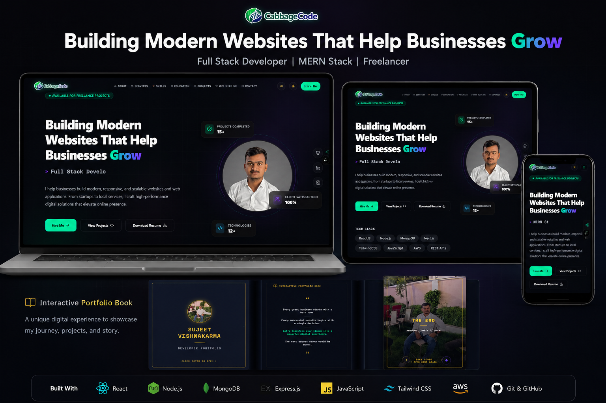

# 🚀 Sujeet Vishwakarma — Developer Portfolio



Welcome to my personal portfolio website!
This project showcases my skills, projects, and passion for building modern, responsive, and interactive web applications.

---

## 🌐 Live Demo

🔗 **Visit Here:**
👉 https://my-portfolio-one-ochre-45.vercel.app/

---

## 🧑‍💻 About Me

Hi, I'm **Sujeet Vishwakarma** 👋
A passionate **Frontend Developer** focused on building scalable and user-friendly web applications using **React.js**.

* 💻 Skilled in React.js & JavaScript
* 🎯 Focused on UI/UX and performance
* 🚀 Continuously learning and improving

---

## ⚡ Features

✨ Modern and clean UI
📱 Fully responsive design (Mobile + Desktop)
🎬 Smooth animations and transitions
🧭 Interactive Navbar with share functionality
📂 Projects showcase section
📩 Functional Contact Form (Data received by me)
🔗 Social & share functionality
📌 Clean and structured Footer

---

## 📩 Contact Form Functionality

💡 The contact form is fully functional!

When a user fills out the form:

* 📥 The submitted details (Name, Email, Message) are **sent directly to me**
* 📧 I receive the data via **Email / Backend / Google Sheets (depending on integration)**

👉 This ensures I can respond quickly to any inquiries or opportunities.

---

## 🛠️ Tech Stack

* ⚛️ React.js
* 🎨 Tailwind CSS / CSS
* 📜 JavaScript (ES6+)
* 🌐 HTML5
* 🚀 Vercel (Deployment)

---

## 🎬 UI & Animation Enhancements

This portfolio includes:

* Smooth scrolling effects
* Hover animations on buttons & cards
* Section-based transitions
* Interactive cursor (CustomCursor)

🚀 Upcoming Improvements:

* Framer Motion animations
* Page transition effects
* Micro-interactions for better UX

---

## 📁 Project Structure

```bash
my-portfolio/
│── public/
│── src/
│   ├── components/
│   │   ├── About.jsx
│   │   ├── Contact.jsx
│   │   ├── CustomCursor.jsx
│   │   ├── Footer.jsx
│   │   ├── Hero.jsx
│   │   ├── Navbar.jsx
│   │   ├── Projects.jsx
│   │   ├── ShareButton.jsx
│   │   ├── Skills.jsx
│   ├── assets/
│   ├── App.js
│   ├── index.js
│── package.json
```

---

## 🚀 Getting Started

Follow these steps to run locally:

```bash
git clone https://github.com/sujeetvishwakarma83/my-portfolio
cd my-portfolio
npm install
npm start
```

---

## 📸 Sections Included

* 🏠 Home (Hero Section)
* 🧭 Navbar
* 🙋 About Me
* 🛠️ Skills
* 💼 Projects
* 📩 Contact
* 📌 Footer

---

## 🔄 Current Progress

🚧 I am actively improving this portfolio:

* Enhancing React components
* Improving performance
* Adding advanced animations
* Making UI more interactive

---

## 🤝 Connect With Me

* 💼 LinkedIn: [www.linkedin.com/in/sujeet-vishwakarma-a19b2323a](http://www.linkedin.com/in/sujeet-vishwakarma-a19b2323a)
* 💻 GitHub: https://github.com/sujeetvishwakarma83
* 📧 Email: [sujeet.cabbagecode@gmail.com](mailto:sujeet.cabbagecode@gmail.com)

---

## ⭐ Show Your Support

If You like this project, give it a ⭐ on GitHub and share it!

---

## 💬 Final Note

This Portfolio represents my journey as a developer —
and I am continuously learning, building, and improving 🚀
